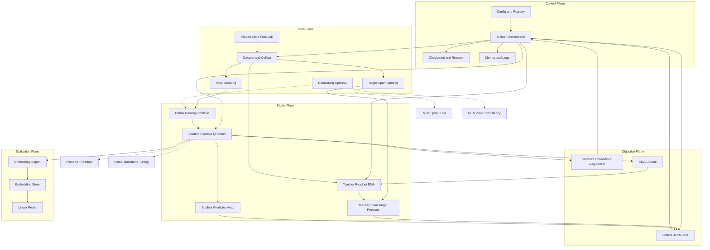

# Genos-m Readout JEPA v1

PyTorch/Transformers-ready v1 codebase for learning **general-purpose sequence embeddings** from frozen Genos-m hidden states (`H: [B, L, D_in]`) using a query-based readout head and JEPA-style latent prediction.

## Genos-m Readout JEPA architecture



## Implemented modules

- `data/`
  - `hidden_state_dataset.py`: loads precomputed hidden states (`.pt/.pth/.npy/.npz`)
  - `collate.py`: variable-length padding collate
  - `masking.py`: student corruption / masking
  - `span_sampler.py`: contiguous target span sampler
  - `extract_hidden_states.py`: optional hidden-state extraction via `transformers`
- `models/`
  - `chunk_pooling.py`: token pre-aggregation (chunk/stride pooling)
  - `readouts.py`: `ReadoutQFormer`, `MeanPoolingReadout`, `LastTokenReadout`, `AttentionPoolingReadout`
  - `jepa.py`: `TeacherStudentJEPA` with EMA teacher and span target prediction
- `losses/jepa_losses.py`: cosine JEPA loss + optional variance/covariance regularization
- `trainers/jepa_trainer.py`: mixed-precision trainer, logging, checkpointing
- `eval/`
  - `export_embeddings.py`: exports `z_seq` embeddings
  - `linear_probe.py`: linear probe evaluation
- `configs/v1.yaml`: default v1 config
- `train.py`: main training entrypoint

## Setup

```bash
source ~/miniconda3/bin/activate
pip install torch transformers pyyaml tqdm
```

## Data format

Each sample should contain `hidden_states: [L, D]` (default `D=1024`).

Supported files:
- `.pt` / `.pth`: tensor or dict (default keys: `hidden_states`, optional `attention_mask`, optional `label`)
- `.npy`: raw hidden-state array
- `.npz`: arrays with `hidden_states` key

## Train

```bash
python train.py --config configs/v1.yaml
```

Example override:

```bash
python train.py --config configs/v1.yaml --override data.data_root=/path/to/hs training.batch_size=4 model.chunk_pooling.chunk_size=128
```

## Export embeddings

```bash
python eval/export_embeddings.py \
  --config configs/v1.yaml \
  --checkpoint outputs/genosm_readout_jepa_v1/checkpoint_epoch_10.pt \
  --output outputs/genosm_readout_jepa_v1/embeddings.pt
```

## Linear probe

```bash
python eval/linear_probe.py --embeddings outputs/genosm_readout_jepa_v1/embeddings.pt
```

## Notes

- Backbone is frozen in v1 (training operates on precomputed hidden states).
- Default efficiency path pools long sequences before Q-Former cross-attention.
- JEPA target is teacher pooled target-span latent (`D_out`), not token reconstruction/logit prediction.

## Optional: extract hidden states from local checkpoint

```bash
python data/extract_hidden_states.py \
  --model-path model/Genos_m.tiny_test \
  --input /path/to/sequences.txt \
  --output-dir data/hidden_states
```
